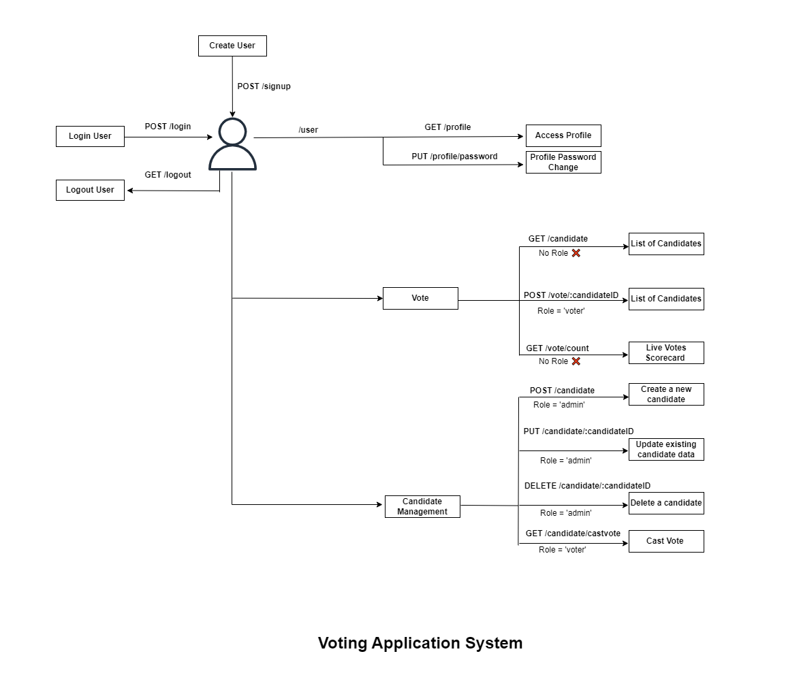

# Voting Application - Node.js

## Project Overview

This Node.js application is a simple voting system designed to facilitate voting processes. It allows users to sign up, log in, vote for candidates, view candidate lists and their vote counts, and update their profile details including password. The application also includes an admin feature to manage candidates.

## API Routing

## Installation

To install and run the application, follow these steps:

1. Clone this repository to your local machine:

2. Navigate to the project directory:

3. Install dependencies using npm:

4. Start the application:

## Routes

### User Authentication:

- `/signup`: **POST** - Create a new user account. ✅
- `/login`: **POST** - Log in to an existing account. [Requires Aadhar card number + password] ✅

### Voting:

- `/candidate`: **GET** - Get the list of candidates. ✅
- `/vote/:candidateId`: **POST** - Vote for a specific candidate. ✅

### Vote Counts:

- `/vote/count`: **GET** - Get the list of candidates sorted by their vote counts. ✅

### User Profile:

- `/profile`: **GET** - Get the user's profile information. ✅
- `/profile/password`: **PUT** - Change the user's password. ✅

### Admin Candidate Management:

- `/candidate`: **POST** - Create a new candidate. ✅
- `/candidate/:candidateId`: **PUT** - Update an existing candidate.
- `/candidate/:candidateId`: **DELETE** - Delete a candidate from the list.

## Note

- The user's data must include a unique government ID proof named "Aadhar card number".
- The admin cannot vote at all.

Feel free to explore and contribute to this project!
